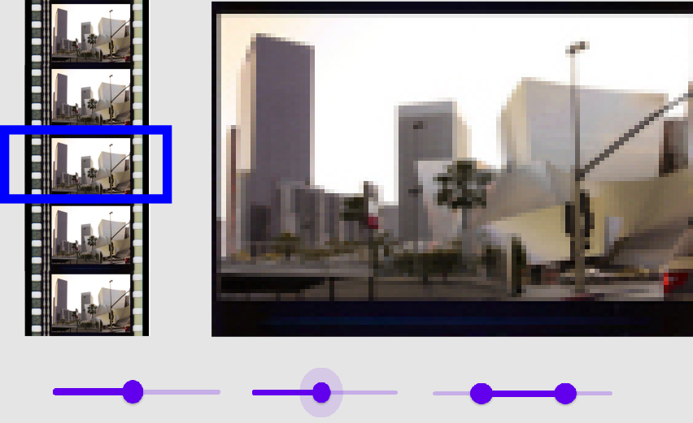

# keyframeViewer_team8
 Défi JellySmack Team 8

> Application VueJS permettant de résumer des vidéo sous forme de keyframes



## Build Setup

```bash
# install dependencies
npm install

# serve with hot reload at localhost:8080
npm run serve

# build for production to run in Cordova
npm run build

```

<!-- ## First Cordova build

Run the command :

```sh
npm run build
cd cordova_app
cordova platform add android
cordova run # or build
```

## Next Cordova build

```sh
npm run cordova_run # or cordova_build
``` -->

## Technos utilisées

- VueJS
- OpenCV